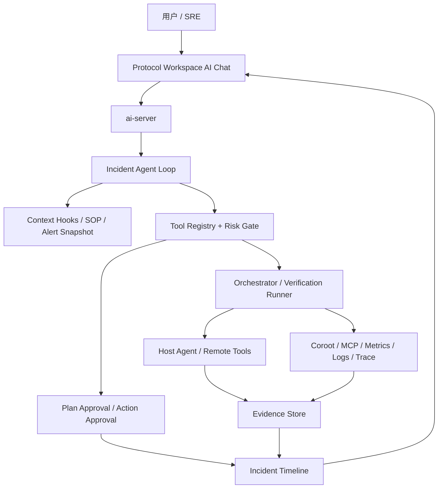

# 运维 Incident Chat 改造设计方案（2026-04-15）

输入文档：[require_0415.md](./require_0415.md)

状态：需求转设计草案

## 0. 本次范围

本次改造的主范围是：

- `协作工作台的 AI Chat 主链路`

主要落点：

- `web/src/pages/ProtocolWorkspacePage.vue`
- `web/src/components/protocol-workspace/*`
- `web/src/lib/workspaceViewModel.js`
- `internal/agentloop`
- `internal/server`
- `internal/orchestrator`

本轮不以单机会话 `ChatPage.vue` 为主战场。`ChatPage` 只作为后续对齐参考，不属于本次设计交付范围。

## 1. 背景

当前 `aiops-codex` 已经具备以下基础能力：

- Chat / Workspace 双入口
- Agent Loop、Tool Invocation、EvidenceRecord 等运行态模型
- 统一审批流与审批审计
- Host Agent 远程执行与 Coroot / MCP 结构化卡片
- 工作台事件流、计划卡、审批 rail、证据弹窗

但这些能力目前仍偏向“会调用工具的运维对话系统”，还没有完全收敛成一个面向生产事故处置的 Incident 操作台。核心缺口不在于是否能回答问题，而在于：

- 过程透明度还不够强
- 证据、计划、执行、验证尚未形成统一闭环
- 聊天、审批、证据、验证、回放之间的语义模型还未统一
- 长任务中断、执行后验证、回滚提示仍然不够系统化

这份设计文档的目标，是基于 [require_0415.md](./require_0415.md) 给出一套贴合现有代码结构的落地方案。

## 2. 设计目标

### 2.1 必须达成

1. 把协作工作台 AI Chat 升级为面向 incident 的工作流界面，而不是单轮问答界面。
2. 建立一套统一的 `模式 -> 阶段 -> 事件 -> 证据 -> 审批 -> 执行 -> 验证 -> 回放` 模型。
3. 让只读分析、计划审批、受控执行、执行后验证成为主链路，而不是附加能力。
4. 复用现有 `internal/agentloop`、`internal/server`、`internal/orchestrator`、`cmd/host-agent`、`web/src/components/protocol-workspace/*`，避免另起系统。

### 2.2 明确不做

1. 不暴露完整思维链原文。
2. 不把自由生成 shell 作为主要执行模型。
3. 不允许无人审批的默认生产修改路径。
4. 不重写现有全部 Chat UI；本轮只改协作工作台 AI Chat 主链路。

## 3. 产品设计结论

### 3.1 核心定位

产品应当被重新定义为：

`证据驱动的运维 Incident 操作台`

而不是：

`会聊天的运维助手`

### 3.2 交互结论

所有会话都必须显式处于以下两种模式之一：

- `分析模式`
- `执行模式`

默认进入分析模式。执行模式不能由模型隐式进入，只能由：

1. Agent 先产出计划卡
2. 用户审批计划
3. 系统切换执行权限

之后才允许变更工具真正落地。

### 3.3 页面结论

主界面不再按“普通聊天 + 零散卡片”组织，而是围绕一个 incident 生命周期组织：

- 主线程：用户对话、阶段推进、关键结论、计划、验证结果
- 证据面板：日志、指标、trace、命令输出、diff
- 审批面板：计划审批、动作审批、拒绝结果
- 时间线：取证、分析、审批、执行、停止、验证、失败
- 结构化结果卡：指标卡、日志卡、变更卡、验证卡、回滚卡、总结卡

## 4. 总体架构



### 4.1 新的抽象层

本次设计新增一个统一语义层：

- `Incident Runtime`

这个 Runtime 不是一个新进程，而是对现有能力的统一抽象，负责：

- 管理模式与阶段
- 聚合事件和证据
- 约束计划与执行
- 挂起审批
- 驱动验证和回放

建议主要落在：

- `internal/agentloop`
- `internal/server`
- `internal/orchestrator`
- `internal/model`
- `internal/store`
- `web/src/pages/ProtocolWorkspacePage.vue`
- `web/src/components/protocol-workspace/*`
- `web/src/lib/workspaceViewModel.js`

## 5. 运行时模型设计

### 5.1 模式状态机

```text
analysis
  -> plan_prepared
  -> waiting_plan_approval
  -> execute
  -> waiting_action_approval
  -> verifying
  -> completed / failed / canceled
```

规则：

- 新会话默认 `analysis`
- 只有计划审批通过后才能进入 `execute`
- `execute` 中的危险动作可进入 `waiting_action_approval`
- 执行动作结束后必须进入 `verifying`
- 任意阶段都可进入 `canceled`，但取消结果需要进一步标注底层是否已真实停止

### 5.2 阶段模型

新增统一阶段枚举，建议写入运行态和事件流：

- `understanding`
- `planning`
- `collecting_evidence`
- `analyzing`
- `waiting_plan_approval`
- `executing`
- `waiting_action_approval`
- `verifying`
- `rollback_suggested`
- `completed`
- `failed`
- `canceled`

### 5.3 事件模型

现有 `Card`、`ToolInvocation`、`EvidenceRecord` 继续保留，但要引入更强的事件语义。建议新增 `IncidentEvent`：

```go
type IncidentEvent struct {
    ID           string         `json:"id"`
    SessionID    string         `json:"sessionId"`
    RunID        string         `json:"runId,omitempty"`
    IterationID  string         `json:"iterationId,omitempty"`
    Stage        string         `json:"stage,omitempty"`
    Type         string         `json:"type"`
    Status       string         `json:"status,omitempty"`
    Title        string         `json:"title,omitempty"`
    Summary      string         `json:"summary,omitempty"`
    HostID       string         `json:"hostId,omitempty"`
    ToolName     string         `json:"toolName,omitempty"`
    EvidenceID   string         `json:"evidenceId,omitempty"`
    ApprovalID   string         `json:"approvalId,omitempty"`
    Verification string         `json:"verification,omitempty"`
    Metadata     map[string]any `json:"metadata,omitempty"`
    CreatedAt    string         `json:"createdAt,omitempty"`
}
```

事件类型建议：

- `stage.changed`
- `plan.generated`
- `plan.approval_requested`
- `plan.approved`
- `tool.started`
- `tool.completed`
- `tool.failed`
- `evidence.attached`
- `action.approval_requested`
- `action.approved`
- `action.rejected`
- `verification.started`
- `verification.passed`
- `verification.failed`
- `rollback.suggested`
- `run.canceled`
- `run.completed`

### 5.4 证据模型

现有 `EvidenceRecord` 需要补齐引用关系，不再只是大文本存档。建议扩展字段：

- `SourceKind`：log / metric / trace / command / config_diff / approval / plan / verification
- `SourceRef`：PromQL、TraceID、HostID、FilePath、ToolInvocationID 等
- `CitationKey`：供最终结论引用
- `Confidence`：可选，表示证据完整度
- `RelatedEvidenceIDs`：证据之间的链路

关键要求：

- 结论必须引用证据
- 证据必须可跳回结论和事件

### 5.5 验证模型

新增 `VerificationRecord`，由执行动作后的自动验证链路写入：

```go
type VerificationRecord struct {
    ID              string         `json:"id"`
    RunID           string         `json:"runId"`
    ActionEventID   string         `json:"actionEventId"`
    Status          string         `json:"status"`
    Strategy        string         `json:"strategy"`
    SuccessCriteria []string       `json:"successCriteria,omitempty"`
    Findings        []string       `json:"findings,omitempty"`
    EvidenceIDs     []string       `json:"evidenceIds,omitempty"`
    RollbackHint    string         `json:"rollbackHint,omitempty"`
    Metadata        map[string]any `json:"metadata,omitempty"`
    CreatedAt       string         `json:"createdAt,omitempty"`
}
```

状态建议：

- `pending`
- `running`
- `passed`
- `failed`
- `inconclusive`

## 6. 后端设计

### 6.1 `internal/model`

基于现有 `AgentLoopRun`、`ToolInvocation`、`EvidenceRecord` 做增量扩展：

- `AgentLoopRun`
  - 增加 `incidentId`
  - 增加 `stage`
  - 增加 `planApprovalStatus`
  - 增加 `executionEnabled`
  - 增加 `verificationStatus`
- `ToolInvocation`
  - 增加 `riskLevel`
  - 增加 `requiresApproval`
  - 增加 `dryRunSupported`
  - 增加 `targetSummary`
- `EvidenceRecord`
  - 增加证据类型、引用链、sourceRef
- 新增
  - `IncidentEvent`
  - `VerificationRecord`
  - 可选 `RollbackSuggestion`

### 6.2 `internal/agentloop`

Agent Loop 继续作为主控制器，但新增 Incident 语义层：

1. `StageEmitter`
   负责在每轮 loop 中发出阶段变化事件。

2. `PlanGate`
   阻止在计划审批前进入执行态。

3. `EvidenceBinder`
   负责把工具输出落为 `EvidenceRecord`，同时生成引用摘要回灌模型。

4. `RiskGate`
   基于工具元数据决定：
   - 只读直接执行
   - 危险动作进入审批
   - 非法动作直接拒绝

5. `VerificationTrigger`
   执行完成后自动拼装验证任务并回灌结果。

6. `CancellationManager`
   管理用户停止动作，向模型调用、host-agent、外部 HTTP 请求广播取消。

### 6.3 `internal/server`

`server` 层负责把 Incident Runtime 投影给前端和持久化层：

- 提供 incident timeline 查询接口
- 提供 evidence 详情接口
- 提供 verification 详情接口
- 统一处理计划审批和动作审批
- 将后台验证结果流式推送回 session snapshot

建议新增或扩展：

- `/api/v1/incidents/{id}`
- `/api/v1/incidents/{id}/timeline`
- `/api/v1/evidence/{id}`
- `/api/v1/verifications/{id}`
- `/api/v1/approvals/{id}` 继续复用，但加入 `approvalKind=plan|action`

### 6.4 `internal/orchestrator`

目前 orchestrator 更偏多主机调度，本次需要补齐：

- 计划步骤到执行步骤的映射
- 执行后验证的 runner
- 回滚建议生成
- 跨主机动作的 blast radius 计算

不建议把验证逻辑直接塞进前端或 tool schema 文本中，应该由 orchestrator 负责统一调度。

### 6.5 `internal/tools` / `internal/mcphost`

工具定义需要从“普通 function tool”升级为“带风险语义的可执行单元”。

建议每个工具都有如下元数据：

```go
type RiskMeta struct {
    AccessMode        string   // readonly | mutation
    RiskLevel         string   // low | medium | high | critical
    RequiresPlan      bool
    RequiresApproval  bool
    DryRunSupported   bool
    RollbackSupported bool
    VerifyStrategies  []string
    TargetKinds       []string
}
```

这层元数据不替代审批逻辑，但决定：

- 是否允许在当前模式执行
- 是否要挂起审批
- 是否要生成 dry-run
- 执行后如何自动验证

### 6.6 `cmd/host-agent` / `internal/agentrpc`

Host Agent 需要补齐三类能力：

1. `Cancellation`
   接收上游 cancel token，尽量中断命令或标注不可中断。

2. `Identity passthrough`
   请求携带操作者身份与授权上下文，而不是只有平台 token。

3. `Structured execution result`
   返回结构化结果，不只是一段 stdout/stderr。

建议远程执行结果包含：

- target
- command / tool
- startedAt / completedAt
- exitCode
- cancelable
- cancelStatus
- stdoutSummary / stderrSummary
- evidencePayload

## 7. 前端设计

### 7.1 页面策略

本次不新建第三套页面，优先升级协作工作台相关页面和组件：

- `web/src/pages/ProtocolWorkspacePage.vue`
- `web/src/lib/workspaceViewModel.js`
- `web/src/components/protocol-workspace/*`

### 7.2 主界面布局

统一为 4 个语义区：

1. `Conversation`
   用户消息、Agent 回复、计划卡、验证结果卡、总结卡。

2. `Timeline`
   展示阶段推进、审批、执行、验证、停止等关键事件。

3. `Evidence`
   展示日志、指标、trace、终端输出、配置 diff。

4. `Approval / Action Rail`
   展示计划审批、动作审批、拒绝结果和恢复入口。

### 7.3 卡片体系

统一定义以下卡片为正式能力：

- `PlanCard`
- `MetricCard`
- `LogCard`
- `TraceCard`
- `ApprovalCard`
- `ActionCard`
- `VerificationCard`
- `RollbackCard`
- `SummaryCard`

注意：

- 卡片是主线程的一部分，但不是全部正文
- 大输出默认进入 Evidence 面板
- Timeline 不回灌为重复正文

### 7.4 模式与状态提示

前端必须始终展示：

- 当前模式：分析 / 执行
- 当前阶段
- 是否有待审批项
- 是否有后台验证任务
- 是否可停止

### 7.5 结构化下一步动作

每个关键结论后，前端应支持按钮化下一步：

- 按实例展开
- 查看最近变更
- 对比发布前后
- 生成回滚方案
- 进入执行审批

这些按钮本质上是触发新一轮带结构化上下文的用户动作，而不是简单文本快捷回复。

## 8. 权限、安全与审计设计

### 8.1 身份透传

设计要求：

- 工具执行必须能感知当前用户身份
- 审批记录必须绑定操作者和审批人
- 平台不应通过全局高权限 token 掩盖用户权限不足

### 8.2 审批分层

审批分为两层：

1. `Plan Approval`
   用户确认允许系统进入执行态。

2. `Action Approval`
   危险动作逐项审批，必要时支持 session/host 级 grant。

### 8.3 审计回放

审计要能按以下维度筛选：

- incident
- host
- operator
- approval type
- tool name
- time range
- decision

现有 `ApprovalAuditRecord` 继续复用，但需要补齐与 `IncidentEvent`、`VerificationRecord` 的关联。

## 9. 执行后验证设计

这是本次改造的关键增量，不应作为“后面再说”的附加功能。

### 9.1 触发时机

以下动作完成后默认触发验证：

- 服务重启
- 配置下发
- rollout / rollback
- 扩缩容
- 缓存清理

### 9.2 验证来源

验证优先使用结构化来源，而不是让模型再次自由判断：

- Coroot 健康状态
- 指标查询
- 错误率/延迟趋势
- 健康探针
- 关键日志关键字
- 最近告警状态

### 9.3 验证输出

验证完成后要给用户三个层级的结果：

1. `状态`
   已恢复 / 未恢复 / 不确定

2. `证据`
   哪些指标或日志支撑该判断

3. `后续动作`
   回滚 / 隔离 / 扩容 / 深挖

## 10. 落地路径

### Phase 1：统一 Incident 语义

- 扩展运行态模型
- 增加 `IncidentEvent`
- 打通 timeline 与 evidence 引用
- 补齐模式、阶段、计划审批状态

### Phase 2：计划门控与风险元数据

- 工具增加风险属性
- 接入 PlanGate 和 RiskGate
- 计划审批成为执行前置条件

### Phase 3：执行后验证与停止传播

- 加入 `VerificationRecord`
- 补齐 host-agent cancel
- 动作完成后自动跑验证

### Phase 4：前端 Incident 工作台化

- 收敛协作工作台 AI Chat 的事件、证据、审批和卡片容器
- 增加模式提示、阶段提示、下一步按钮
- 完善回放视图

## 11. 验收原则

本次设计最终以 [require_0415.md](./require_0415.md) 的 6 个场景为验收主线，重点看以下结果：

1. 用户能否始终知道系统当前在做什么。
2. 用户能否看到关键结论对应的证据。
3. 用户能否在执行前看到计划、风险和回滚。
4. 用户能否在执行中真实停止任务。
5. 用户能否在执行后看到验证结果而不是只看“命令成功”。
6. 用户能否在事后回放整个 incident 过程。

## 12. 一句话结论

这轮设计不是给所有聊天页同时加几个卡片，而是先把协作工作台 AI Chat 重组为一套统一的 Incident Runtime，让系统从“能回答”升级为“能受控处置、能证明、能回放”。
