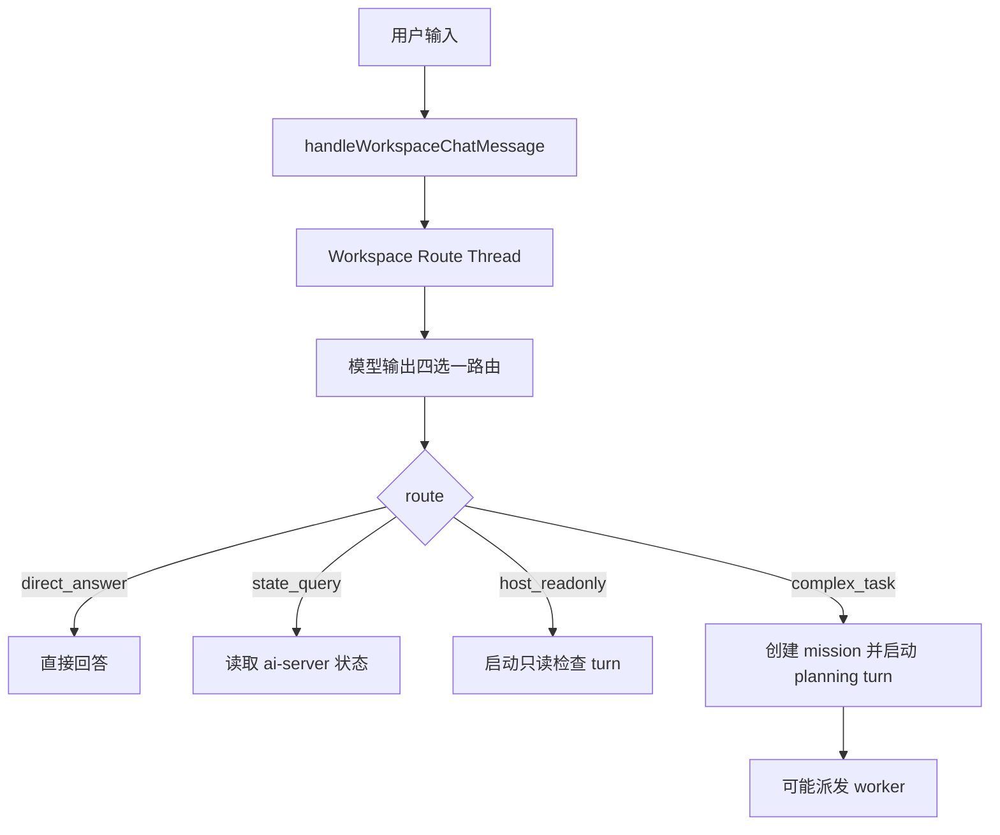
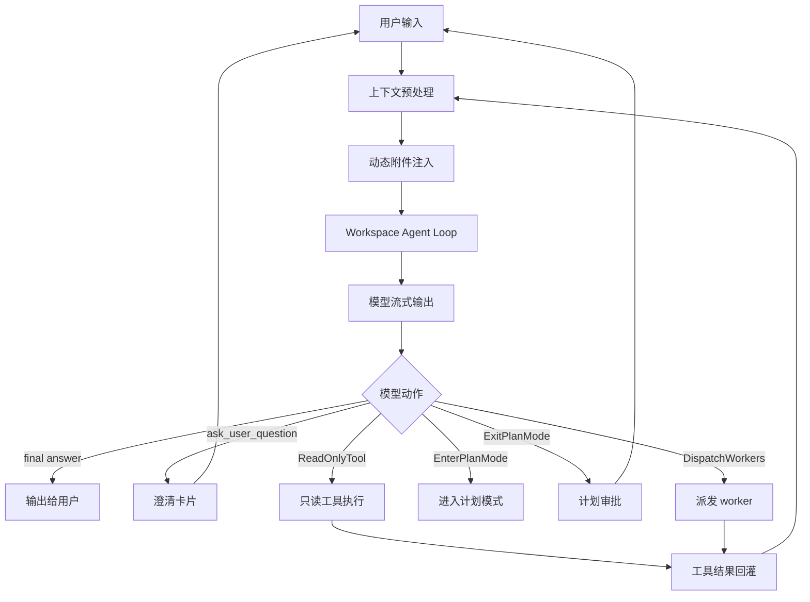
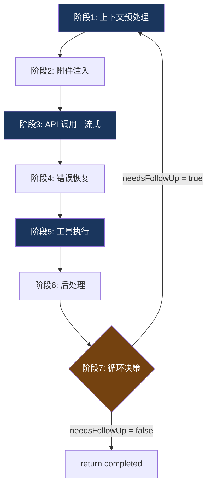
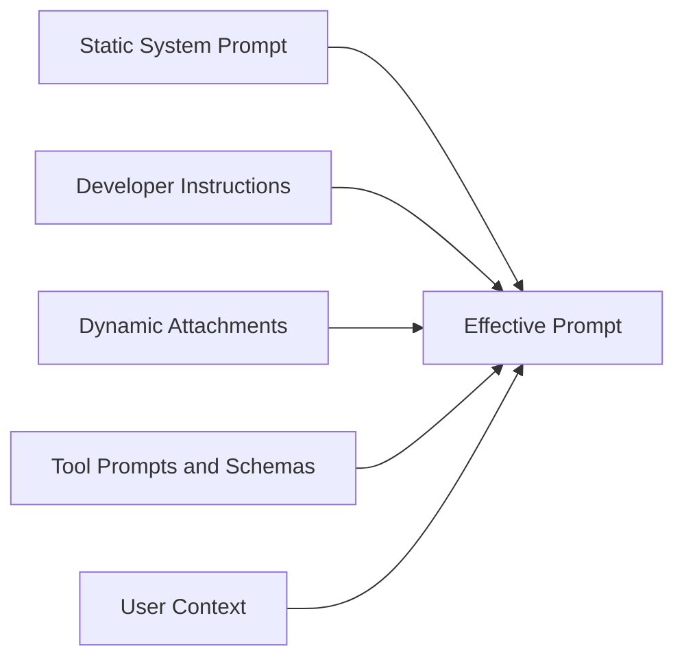

# 协作工作台 Claude Code 式 ReAct 模式改造方案

日期：2026-04-08

状态：需求与设计草案

## 1. 背景

当前协作工作台采用“先路由，再进入不同执行链路”的模式。用户消息进入后，后端先启动 route turn，让模型在 `direct_answer`、`state_query`、`host_readonly`、`complex_task` 四个路由中选择一个。这个模式在“明确执行”的场景下可用，但在“意图不明确”的场景下容易过度执行。

典型问题：

- 用户说“你有办法修复 PG 不同步的问题吗？”时，可能只是询问 AI 能力，也可能希望 AI 开始修复。
- 当前 route prompt 没有 `clarify_intent` 出口，模型容易把 PG 不同步判断为 `complex_task`。
- 一旦进入 `complex_task`，后端会自动创建 mission、启动 planning、可能派发 worker。
- 这会让用户感觉“只是问一句，系统就开始干活”，授权边界不清晰。

目标是把协作工作台改成更接近 Claude Code 的 ReAct 模式：模型在一个主循环里基于上下文、附件和工具能力，自主选择“直接回答、澄清、只读探索、进入计划模式、请求审批、执行工具”，而不是被前置四分类路由强行推进。

本文中的 `ReAct` 指 Reason -> Act(tool) -> Observe -> Continue 的工具调用循环，不是前端 React 框架。

## 2. 需求方案

### 2.1 必须实现

1. 用户意图不明确时必须先澄清，不得直接启动 mission、planning、worker 或 host 命令。
2. “你有办法/能不能/可以吗/会不会/是否能处理”这类能力询问，默认按“能力询问或授权不明”处理。
3. 协作工作台保留一个主 Agent 对话入口，用户不需要理解 route thread、planner thread、shadow session 等内部概念。
4. 主 Agent 必须支持 Claude Code 式 ReAct 循环：模型输出工具调用，系统执行工具，工具结果回灌，再由模型决定是否继续。
5. 主 Agent 必须支持平台自定义动态工具 `ask_user_question`，用于澄清意图、范围、风险授权和关键决策；不得依赖 Codex Default mode 下受限的内置 `request_user_input`。
6. 主 Agent 必须支持 `Plan Mode` 等价能力：进入计划模式后只允许只读探索和更新计划，不允许修改配置、执行变更、派发 worker。
7. 只有用户明确授权后，才能从计划模式进入执行模式，或调用 worker 派发工具。
8. 所有工具调用、澄清问题、计划、审批和命令输出必须能被前端证据弹框还原。
9. 右侧实时事件必须保留跨轮历史，不因用户重新输入而清空。
10. 失败恢复必须有熔断机制，不能在上下文过长、输出截断或模型过载时无限重试。

### 2.2 不在第一阶段做

1. 不一次性删除现有 mission / worker / approval 存储模型。
2. 不要求完全复制 Claude Code 的所有工具、hooks、skills 和 MCP delta 机制。
3. 不做通用 DAG 引擎。
4. 不让 worker 之间直接通信。
5. 不把所有历史会话迁移成新格式；历史数据只做兼容读取。

### 2.3 用户体验目标

用户输入：

```text
你有办法修复 pg 不同步的问题吗？
```

期望响应：

```text
可以处理，但我需要先确认你的意图：你只是想了解我是否能解决，还是希望我开始只读诊断 PG 不同步问题？
```

可选项：

- 只问能力：直接说明可处理范围和所需信息。
- 开始只读诊断：允许读取配置、进程、日志和状态，但不修改。
- 先给修复思路，不操作：给出排查/修复方案，不执行任何工具。

## 3. 当前架构问题

当前流程：



问题点：

- 路由集合没有“澄清意图”。
- route turn 的职责过重，既要判断，又要给用户可见回复。
- `complex_task` 一旦被选中，Go 后端会无条件进入 mission/planning 链路。
- 模型没有在同一主循环里观察工具结果、澄清用户、更新计划的机会。
- prompt 是固定 route prompt，不像 Claude Code 那样按 turn 注入 plan mode、权限状态、MCP/skill 等动态附件。

## 4. 目标架构

目标流程：



核心变化：

- 删除“用户消息先强制四分类”的硬前置路由。
- 引入 `WorkspaceAgentLoop`，它是协作工作台的主 Agent 循环控制器。
- route 判断变成模型可选择的行为之一，而不是后端唯一入口。
- 用户澄清、计划、只读检查、worker 派发都通过工具和权限状态控制。
- Go 层仍然负责可靠性：工具执行、审批、背压、持久化、实时事件和证据投影。

## 5. ReAct 底层原理

### 5.1 七阶段流水线



### 5.2 阶段 1：上下文预处理

目标是保证传给模型的消息既完整又不超预算。

需要实现或等价实现：

- `enforceToolResultBudget()`：检查单消息聚合预算，例如单条工具结果不超过 200K 字符。
- `snipCompactIfNeeded()`：裁剪历史中低价值或可摘要的内容。
- `microcompactMessages()`：清理旧工具结果，只保留摘要、状态、证据索引。
- `autoCompactIfNeeded()`：当上下文接近模型上限时，触发全量压缩。

本项目落地方式：

- 对 `CommandCard.Output`、worker transcript、历史 `ToolResult` 做摘要化。
- 完整输出进入证据存储，主上下文只保留摘要和 evidence id。
- 对长 mission 按轮次生成 checkpoint summary，避免每轮都塞全量历史。

### 5.3 阶段 2：附件注入

附件是 Claude Code 的关键设计之一。它把“当前 turn 需要知道的状态”作为动态上下文注入，而不是把所有规则都写死在一个全局 prompt 中。

本项目需要的附件：

- `workspace_state`：当前 session、mission、选中 host、运行阶段。
- `approval_state`：待审批数量、审批类型、是否阻塞。
- `event_summary`：最近实时事件摘要，以及历史事件 evidence id。
- `plan_mode`：是否处于计划模式；如果是，只允许只读工具和计划更新。
- `permission_mode`：当前是否允许 mutation、是否允许 worker dispatch。
- `host_context`：当前 host 是否在线、host-agent 能力、默认 cwd。
- `tool_schema_delta`：本轮可用工具及参数 schema。
- `memory_prefetch`：长期记忆或经验包命中摘要。
- `mcp_instructions_delta`：MCP 连接状态和工具说明变化。

### 5.4 阶段 3：API 调用（流式）

Claude Code 形态：

```typescript
for await (const message of deps.callModel({
  messages: prependUserContext(messagesForQuery, userContext),
  systemPrompt: fullSystemPrompt,
  tools: toolUseContext.options.tools,
  signal: toolUseContext.abortController.signal,
  // ...
})) {
  // 流式接收 + 边收边执行工具
}
```

本项目落地方式：

- 如果继续依赖 Codex app-server，`ai-server` 侧通过 `thread/start` / `turn/start` 启动 turn，通过 notification stream 接收 `assistant_delta`、`tool_use`、`tool_result`、`turn_completed`。
- 如果后续自建模型调用层，`ai-server` 内部实现同样的 `callModel()` 抽象，返回统一的流式事件。
- UI 只消费 `WorkspaceAgentEvent`，不直接依赖底层模型供应商事件格式。

### 5.5 阶段 4：错误恢复

错误恢复必须分层，从轻到重，且每层有重试计数和熔断。

需要覆盖：

- `prompt_too_long`：先做 compact，再做 reactive compact，最后截断最旧消息。
- `max_output_tokens`：先提高输出限制，再注入恢复消息。
- 模型过载：切换 fallback model。
- 工具超时：标记工具失败，把失败观察回灌给模型，而不是直接终止整个 session。
- Codex app-server 断连：中止当前 loop，持久化失败证据，允许用户重试。

恢复消息建议：

```text
Output token limit hit. Resume directly — no apology, no recap of what you were doing. Pick up mid-thought if that is where the cut happened. Break remaining work into smaller pieces.
```

熔断建议：

```typescript
const MAX_CONSECUTIVE_AUTOCOMPACT_FAILURES = 3

if (tracking?.consecutiveFailures >= MAX_CONSECUTIVE_AUTOCOMPACT_FAILURES) {
  return { wasCompacted: false }
}
```

### 5.6 阶段 5：工具执行

工具执行需要分并行和串行：

- 只读查询工具可以并行，例如读取 ai-server 状态和读取 host 列表。
- 同一 host 上的命令工具默认串行，避免状态竞争。
- mutation 工具必须经过审批或明确授权。
- `ask_user_question` 是阻塞型平台动态工具，执行后 loop 暂停，等待用户输入。
- `ExitPlanMode` 是审批型工具，执行后 loop 暂停，等待用户批准计划。

### 5.7 阶段 6：后处理

后处理负责把模型输出和工具结果整理成前端可用投影：

- 生成聊天流摘要。
- 生成右侧实时事件。
- 生成证据弹框数据。
- 更新计划卡片。
- 更新审批列表。
- 运行 stop hooks 或 mission completion hooks。
- 检查 token budget 和自动续跑条件。

### 5.8 阶段 7：循环决策

Claude API 依赖 `stop_reason` 驱动循环决策：

| stop_reason | 含义 | 查询引擎反应 |
| --- | --- | --- |
| `end_turn` | 模型认为任务完成 | 结束循环 |
| `tool_use` | 模型请求调用工具 | 执行工具，继续循环 |
| `max_tokens` | 输出被截断 | 尝试恢复，最多 3 次 |

本项目如果继续通过 Codex app-server，需要把 Codex notification 映射成等价状态：

| Codex 事件 | 等价循环状态 |
| --- | --- |
| `tool_use/request` | `needsFollowUp = true` |
| `tool_result` | 工具结果进入下一轮输入 |
| `turn/completed` 且无阻塞工具 | `needsFollowUp = false` |
| `turn/failed` | 进入错误恢复或终止 |
| `approval/pending` | loop 暂停，等待用户 |
| `ask_user_question/pending` | loop 暂停，等待用户 |

### 5.9 为什么用 while(true) 而不是递归

递归调用会导致调用栈增长，长对话或几十轮工具调用时可能栈溢出。`while(true)` 加 `state` 对象传递可以保持恒定栈深度。

```typescript
let state: State = { messages, toolUseContext, tracking, attachments }

while (true) {
  const { messages, toolUseContext } = state

  const iteration = await runOneIteration(state)

  if (iteration.needsFollowUp) {
    state = {
      ...state,
      messages: [...messages, ...iteration.newMessages],
      toolUseContext: iteration.toolUseContext,
      tracking: iteration.tracking,
    }
    continue
  }

  return { reason: 'completed' }
}
```

## 6. Prompt 设计

### 6.1 组装方式

目标是从“一个固定 route prompt”改成“静态系统提示 + 动态附件 + 工具说明”的组合。



建议结构：

1. `Static System Prompt`：协作工作台主 Agent 身份、总体安全边界、输出风格。
2. `Developer Instructions`：本项目运维约束、证据要求、审批要求。
3. `Dynamic Attachments`：plan mode、权限状态、host 状态、mission 状态、MCP/skill 增量。
4. `Tool Prompts`：`ask_user_question`、PlanMode、ReadonlyHost、DispatchWorkers 等工具说明。
5. `User Context`：用户消息、相关历史摘要、当前选中 host。

### 6.2 意图澄清提示词

建议加入：

```text
When the user's wording is a capability question such as "can you", "do you have a way", "is it possible", "能不能", "有没有办法", "可以吗", or "会不会", do not assume authorization to inspect, modify, dispatch workers, or run host commands.

If the request can reasonably mean either "answer whether you can help" or "start doing the work", use the platform dynamic tool `ask_user_question` to clarify before taking action.

For database, deployment, recovery, replication, production, and destructive operations, ask for intent and scope unless the user explicitly authorizes a read-only diagnosis or execution.
```

中文等价：

```text
当用户说“能不能/有没有办法/可以吗/你会不会/是否能处理”时，不要默认用户已经授权你开始诊断、修改、派发 worker 或执行主机命令。

如果一句话既可能是能力询问，也可能是执行请求，必须先使用平台动态工具 `ask_user_question` 澄清。

对数据库、部署、恢复、同步、生产系统、高风险变更类问题，如果用户没有明确授权只读诊断或执行，先确认意图和范围。
```

### 6.3 `ask_user_question` 工具提示词

建议工具说明：

```text
Tool name: ask_user_question.

Use this platform dynamic tool when you need to ask the user questions during execution. This allows you to gather requirements, clarify ambiguous instructions, get decisions on implementation choices, or offer choices about what direction to take.

Use it before action when user intent is ambiguous and the next step would inspect hosts, start a mission, dispatch workers, or perform mutation.

Do not call Codex built-in request_user_input in workspace Default mode. It may be unavailable or rejected by the Codex runtime. Always use ask_user_question for workspace clarifications.
```

### 6.4 Codex runtime 澄清工具决策

当前工作台运行在 Codex runtime 的 Default mode。Codex 内置 `request_user_input` 不是普通 function tool，而是受 collaboration mode / feature gate 控制的内置工具；Default mode 下可能被 runtime 直接拒绝，导致 prompt 要求和 runtime 能力不一致。

本项目采用平台自定义动态工具方案：

1. 工作台 prompt 不再要求模型调用 `request_user_input`。
2. 工作台 prompt 统一要求模型在意图不明确时调用 `ask_user_question`。
3. `ask_user_question` 通过 Codex app-server 的 dynamic tool 暴露，Codex 只把它视为普通工具调用。
4. ai-server 负责执行该工具，生成 ChoiceCard、持久化等待状态，并在用户提交后把答案作为 tool result 回灌 ReAct loop。
5. 前端只展示平台澄清卡片和证据，不暴露 Codex 内部 collaboration mode 或 `request_user_input` 细节。

这种方案比依赖 `default_mode_request_user_input` feature 更稳，因为它不要求用户会话切换到 Plan mode，也不依赖当前 Codex 二进制是否开启某个实验特性。代价是平台需要维护 `ask_user_question` 的 schema、事件、恢复逻辑和 UI 映射。

### 6.5 Plan Mode 提示词

建议工具说明：

```text
Plan mode is active. The user indicated that they do not want execution yet. You MUST NOT make edits, run mutation tools, dispatch workers, restart services, change configs, or otherwise modify the system.

You may only perform read-only exploration and update the plan evidence.

Your turn should only end by asking a clarifying question or submitting the plan for approval.
```

## 7. 工具设计

### 7.1 工具清单

| 工具 | 类型 | 说明 |
| --- | --- | --- |
| `ask_user_question` | 阻塞型 | 平台动态工具；展示名可为 AskUserQuestion；澄清意图、范围、偏好、授权 |
| `EnterPlanMode` | 状态切换 | 进入只读计划模式 |
| `UpdatePlan` | 计划型 | 更新结构化计划和证据 |
| `ExitPlanMode` | 审批型 | 提交计划给用户批准 |
| `QueryAiServerState` | 只读 | 查询 session、mission、host、approval 状态 |
| `ReadonlyHostInspect` | 只读 | 对目标 host 做只读检查 |
| `DispatchWorkers` | 执行型 | 派发 worker，必须在授权后可用 |
| `RequestApproval` | 审批型 | 对 mutation 命令或文件修改申请审批 |
| `SummarizeEvidence` | 后处理 | 把工具结果压缩成用户可读证据 |

### 7.2 `ask_user_question` schema 草案

```json
{
  "name": "ask_user_question",
  "input": {
    "questions": [
      {
        "id": "intent",
        "question": "你是想了解我是否能处理，还是要我开始只读诊断 PG 不同步问题？",
        "options": [
          {
            "label": "只问能力",
            "description": "我只说明可处理范围和需要的信息，不执行任何检查。"
          },
          {
            "label": "开始只读诊断",
            "description": "我会读取状态、配置和日志，但不做修改。"
          },
          {
            "label": "先给修复思路",
            "description": "我给出排查和修复方案，不操作系统。"
          }
        ]
      }
    ]
  }
}
```

### 7.3 DispatchWorkers 约束

`DispatchWorkers` 必须满足至少一个条件：

- 用户在当前轮明确说“开始执行/帮我修复/可以修改/按计划执行”。
- 用户批准了 `ExitPlanMode` 提交的计划。
- 当前任务是只读 worker 任务，且用户已经选择“开始只读诊断”。

否则工具必须返回：

```json
{
  "error": "authorization_required",
  "message": "用户尚未明确授权执行或派发 worker，请先澄清意图。"
}
```

## 8. 数据模型设计

建议新增或等价抽象：

```go
type AgentLoopRun struct {
    ID        string
    SessionID string
    Status    string // running, waiting_user, waiting_approval, completed, failed
    Mode      string // answer, plan, execute
    CreatedAt string
    UpdatedAt string
}

type AgentLoopIteration struct {
    ID        string
    RunID     string
    Index     int
    StopReason string
    NeedsFollowUp bool
    ErrorRecoveryAttempt int
}

type ToolInvocation struct {
    ID         string
    RunID      string
    IterationID string
    Name       string
    InputJSON  string
    OutputJSON string
    Status     string // pending, running, waiting_user, completed, failed
    EvidenceID string
}
```

前端证据弹框应优先读取 `ToolInvocation` 和 `EvidenceID`，而不是猜测“主 Agent 计划摘要”。

## 9. 后端改造方案

### 9.1 第一阶段：最小安全闭环

1. 保留现有 mission / worker / approval。
2. 在 route prompt 前增加 `clarify_intent` 能力，避免继续误触发 `complex_task`。
3. 新增 `ask_user_question` 动态工具、澄清卡片和后端等待状态；不得在工作台 prompt 中要求调用 `request_user_input`。
4. 当模型选择 `clarify_intent` 时，只写澄清卡片，不启动 mission。
5. 用户选择后，把选择作为下一轮输入进入现有链路。

这一阶段成本低，能马上解决“能力询问被当作执行请求”的问题。

### 9.2 第二阶段：引入 WorkspaceAgentLoop

1. 新增 `WorkspaceAgentLoop` 控制器。
2. 统一由 loop 组装 prompt、attachments、tools。
3. route thread 降级为兼容路径或删除。
4. 只读检查、状态查询、planning、dispatch 都变成工具。
5. loop 根据工具结果和 stop reason 决定继续或结束。

### 9.3 第三阶段：计划模式和执行授权

1. 新增 `PlanModeController`。
2. 计划模式下只开放只读工具和 `UpdatePlan`。
3. `ExitPlanMode` 生成审批卡。
4. 用户批准后，loop 模式从 `plan` 切到 `execute`。
5. `DispatchWorkers` 仅在 `execute` 或授权的 `readonly` 范围内可用。

### 9.4 第四阶段：错误恢复和压缩

1. 对工具结果做 evidence 化和摘要化。
2. 实现 `microcompactMessages`。
3. 实现 `autoCompactIfNeeded` 和失败熔断。
4. 对 `max_output_tokens` 注入恢复消息。
5. 对模型过载配置 fallback model。

## 10. 前端改造方案

1. 新增澄清卡片：展示问题、选项、其他输入。
2. 计划卡片默认折叠，样式与 agents 小卡一致，不遮挡输入框和输出。
3. 证据弹框按工具调用展示，而不是默认进入“主 Agent 计划摘要”。
4. 实时事件跨轮保留，按时间排序，并提供命令、工具、审批、澄清、计划的具体摘要。
5. 点击实时事件时打开对应 `ToolInvocation` 或 `EvidenceID`。
6. 对等待用户输入和等待审批状态，在输入框附近明确提示当前阻塞原因。

## 11. 验收标准

### 11.1 意图澄清

- 输入“你有办法修复 pg 不同步的问题吗？”不会启动 mission。
- 页面出现澄清卡片。
- 右侧实时事件显示“等待用户确认意图”，而不是“plan 正在运行中”。
- 选择“只问能力”后，只输出能力说明，不执行命令。
- 选择“开始只读诊断”后，只允许只读工具。

### 11.2 ReAct loop

- 一个任务可以经历“模型 -> 工具 -> 观察 -> 模型继续”的多轮循环。
- 工具结果可以在证据弹框中按 invocation 查看。
- `ask_user_question` 和 `ExitPlanMode` 都能暂停 loop，并在用户响应后恢复。
- loop 使用迭代状态，不使用递归调用。

### 11.3 计划模式

- 计划模式下不能触发 mutation 命令、文件修改或 worker 执行。
- 计划审批前不能调用 `DispatchWorkers`。
- 审批通过后才能进入执行。

### 11.4 错误恢复

- 上下文过长时先 compact，不直接失败。
- compact 连续失败达到阈值后熔断。
- 输出截断时能注入恢复消息继续。
- 模型过载时能切 fallback model 或向用户返回可理解错误。

### 11.5 Playwright 验收路径

1. 打开 `/protocol`。
2. 输入“你有办法修复 pg 不同步的问题吗？”。
3. 断言没有出现“plan 正在运行中”。
4. 断言出现澄清问题和三个选项。
5. 选择“只问能力”，断言没有命令事件。
6. 再输入同一句，选择“开始只读诊断”。
7. 断言只读检查事件出现，且没有 mutation approval。
8. 点击实时事件，断言证据弹框显示具体工具名、输入、输出摘要。

## 12. 风险与取舍

收益：

- 明确授权边界，避免用户只是询问能力时被自动执行。
- 对齐 Claude Code 的工具循环和计划模式。
- 证据链更可解释，前端不再展示空洞的“主 Agent 计划摘要”。
- 长任务可通过 compact 和错误恢复提升稳定性。

代价：

- 多一轮澄清会增加部分任务的交互成本。
- 后端状态机会比四分类 route 更复杂。
- 工具 schema、附件、证据、loop state 都需要统一版本管理。
- 如果 prompt 过度保守，可能让希望快速执行的用户觉得系统“问太多”。

控制策略：

- 只在“能力询问 vs 执行请求”这种授权边界不清晰时强制澄清。
- 对明确指令继续保持高自主性，例如“开始只读检查 PG 不同步问题，不要修改”应直接执行只读诊断。
- 所有澄清都提供可点击选项，减少用户输入成本。

## 13. 推荐落地顺序

1. 先做 `clarify_intent` 路由和澄清卡片，解决当前误执行问题。
2. 再把 route / readonly / planning / dispatch 收敛到 `WorkspaceAgentLoop`。
3. 然后加入 Plan Mode 和 `ExitPlanMode` 审批。
4. 最后补齐 compact、fallback model、tool result budget 和 MCP/skill delta 附件。

这条路径可以逐步替换当前链路，同时保留 mission、worker、approval 的既有可靠性。
